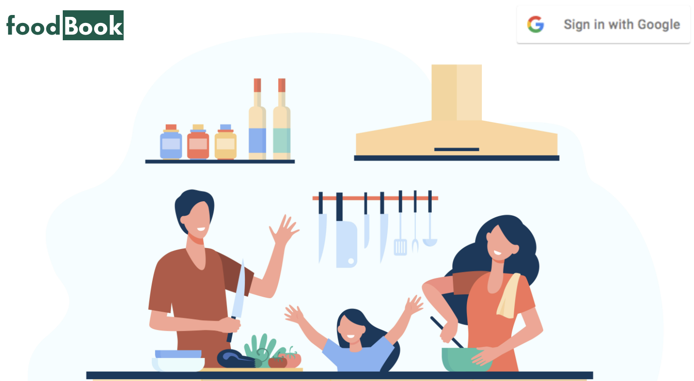
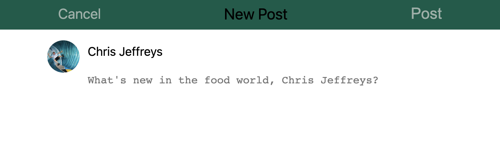
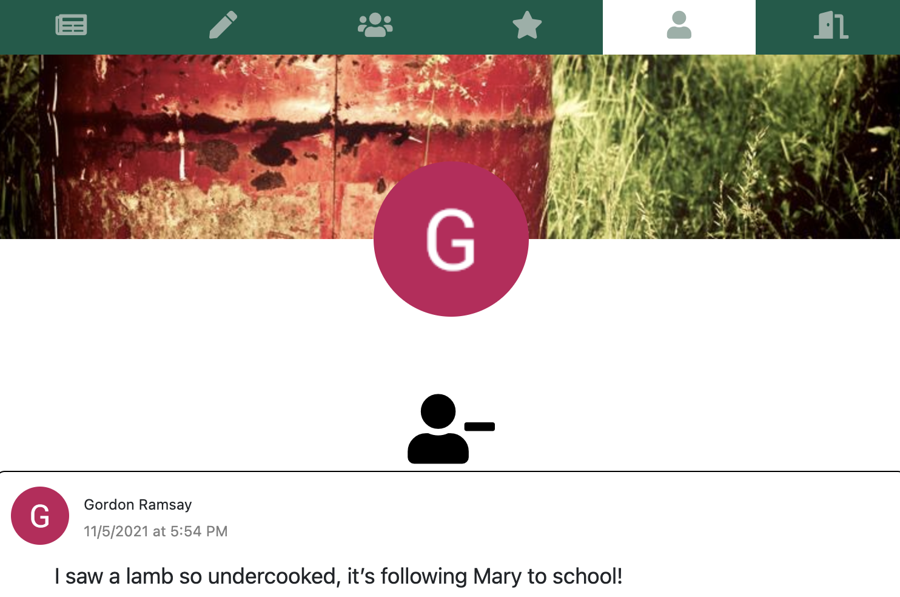
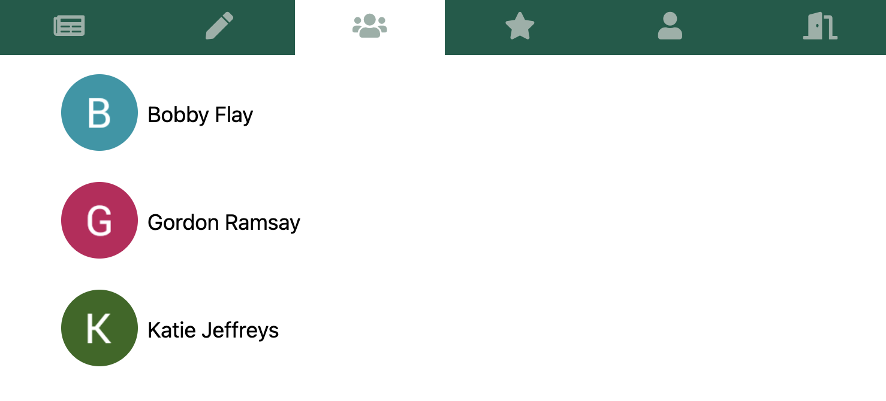
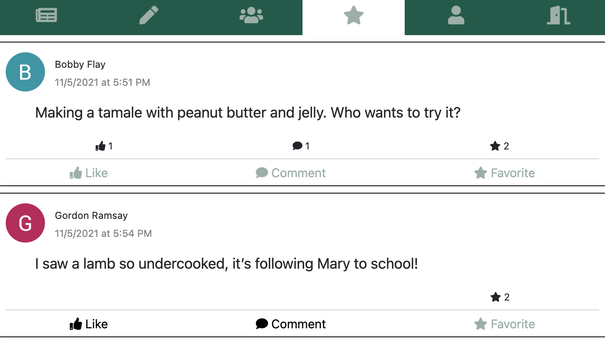
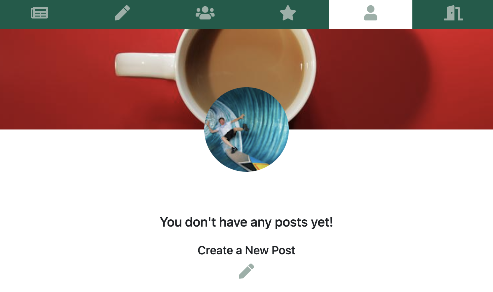
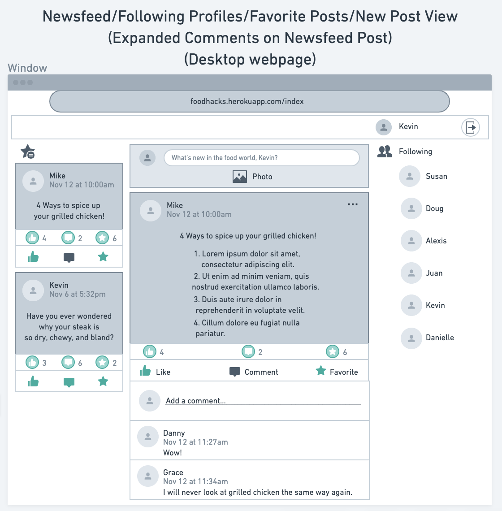

# FoodBook

## Getting Started

### To begin using the social network for all things food, first head to the deployed site [here](https://foodbookapp.herokuapp.com/)!

#### Log into FoodBook by using your Google login:

#### Access your newsfeed by clicking on the newsfeed icon:

#### If you see a post you enjoy, give it a like! Share your thoughts by commenting on the post, and favorite the post to easily find it again later:

#### If you have something to share with the rest of the culinary world, create your own post by clicking on the new post icon:

#### If someone is dishing out some delicious content, click on their profile icon to check out their profile and start following them:

#### You can see all profiles you are following by clicking on the followed profiles icon:

#### To see any posts that stood out to you, head over to your favorites by clicking on the favorites icon:

#### To see how your profile looks, click on the profile icon or click on your profile icon in one of your posts:

#### Start cooking up some content and enjoy what others are serving on FoodBook!
## Technologies Used

- JavaScript
- HTML
- EJS
- CSS
- Node.js
- Express
- MongoDB
- Mongoose

## Wireframe

#### Additional wireframes can be seen [here](https://trello.com/b/87eZplTi/foodbook)

## Attributions:

* Icons from [FontAwesome](https://fontawesome.com/)
* Images from [Freepik](): Vectors from [pch.vector](https://www.freepik.com/pch-vector)

## Next Steps

- [x] OAuth login
- [x] User can see a feed of Posts
- [x] User can create a new Post
- [x] User can view another User's Profile
- [x] User can follow another User
- [x] User can view followed User Profiles
- [x] User can favorite a Post
- [x] User can view favorited Posts
- [x] User can view own Profile to see own Posts
- [ ] User can view a Post
- [x] User can Comment on a Post
- [x] User can edit own Posts
- [x] User can delete own Posts
- [x] User can edit own Comments
- [x] User can delete own Comments
- [ ] User can attach images to Posts
- [ ] User can update Profile Image and Profile Background Image
- [ ] User can route back to relevant page from the Post view
- [ ] User can dynamically load more Posts in Newsfeed view when scrolling to bottom of currently loaded Posts
- [ ] User can Like, Favorite, or Comment on a Post without reloading the page
- [ ] User can see Notifications from activity on own Posts
- [ ] User can flag a Post
- [ ] Admin can review flagged Posts